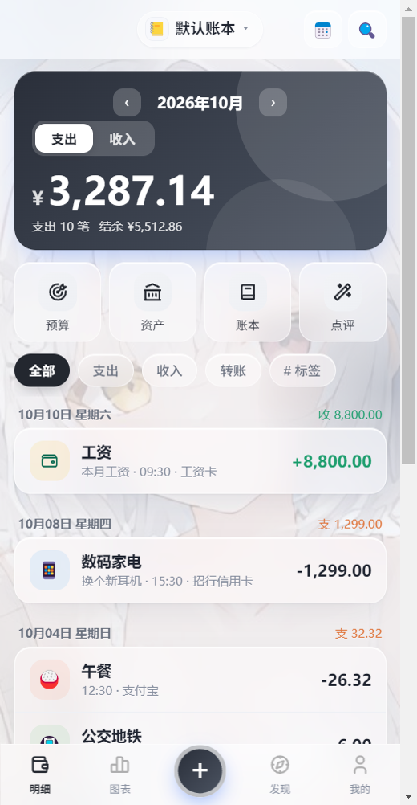
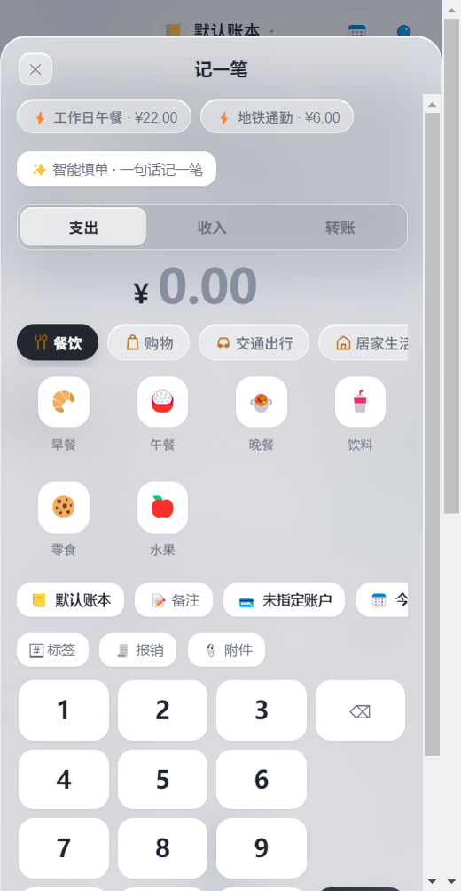
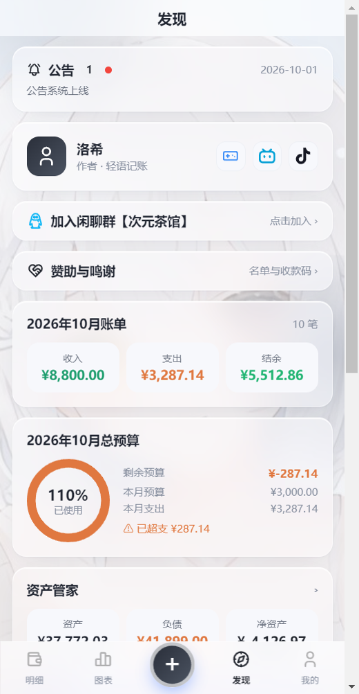
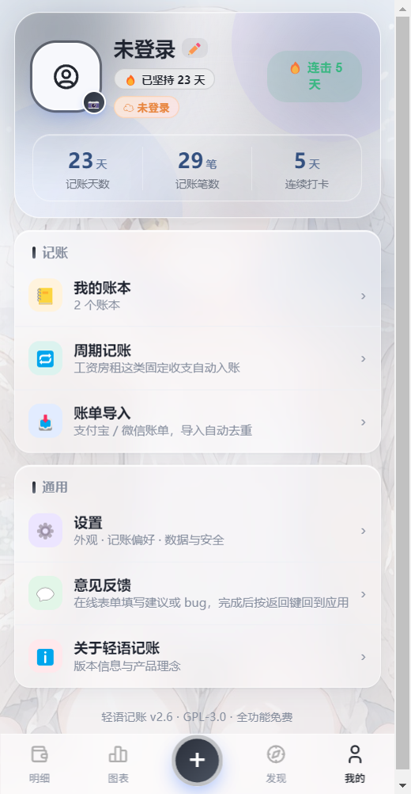
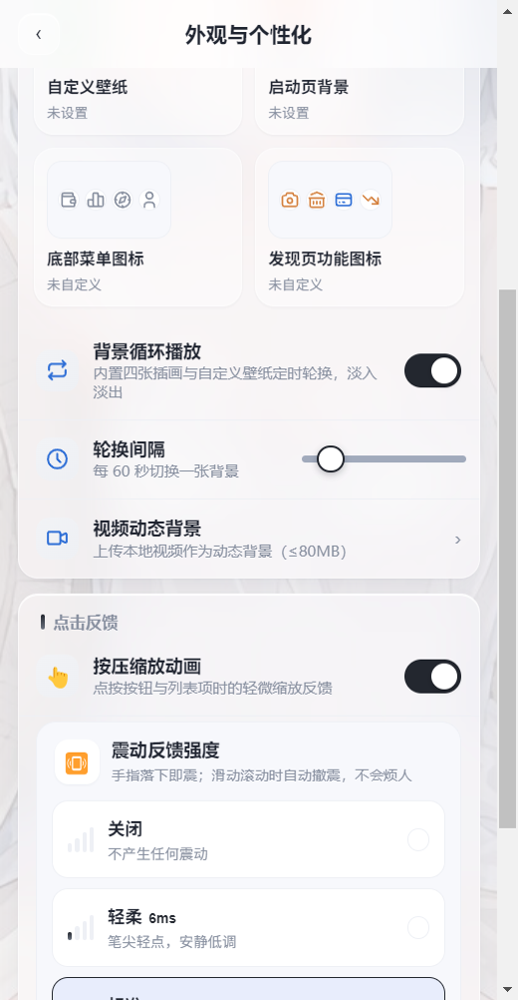
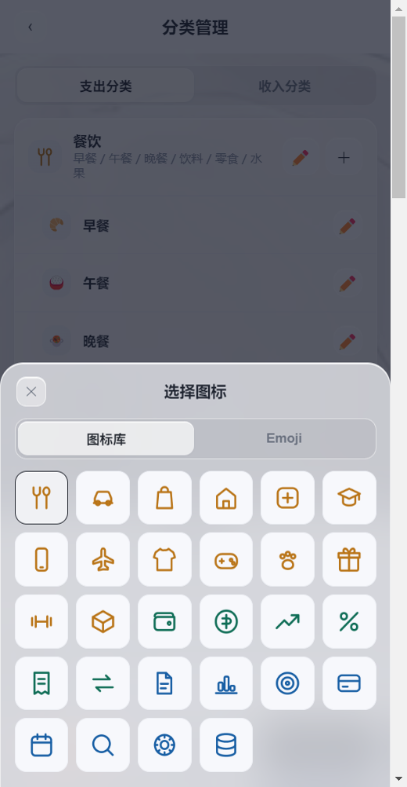
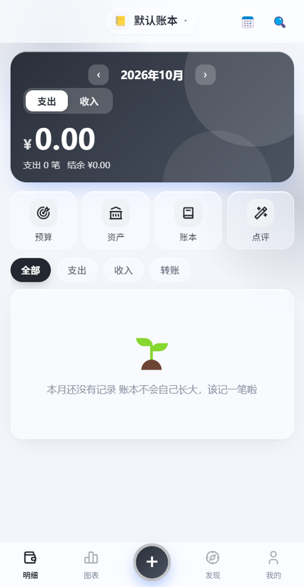

<div align="center">


# 轻语记账 · Qingyu Ledger

**把每一笔钱，轻轻说清楚。**

一款开源免费的极简记账 App —— 记账只要三秒，看得清每一分钱。

[](https://github.com/louhi-zero/qingyu-ledger/releases)
[](LICENSE)
[](https://github.com/louhi-zero/qingyu-ledger/releases)
[](#-技术栈)
[](#-测试与质量)

[下载安装](#-安装) · [核心功能](#-核心功能) · [界面预览](#-界面预览) · [从源码构建](#-从源码构建) · [赞助与鸣谢](#-赞助与鸣谢)

**镜像仓库：** [Gitee](https://gitee.com/louhi-zero/qingyu-ledger) · [GitCode](https://gitcode.com/louhi-zero/qingyu-ledger) · [AtomGit](https://atomgit.com/louhi-zero/qingyu-ledger)

</div>

---

## 📑 目录

- [核心亮点](#-核心亮点)
- [界面预览](#-界面预览)
- [核心功能](#-核心功能)
- [安装](#-安装)
- [从源码构建](#-从源码构建)
- [项目结构](#-项目结构)
- [技术栈](#-技术栈)
- [测试与质量](#-测试与质量)
- [隐私承诺](#-隐私承诺)
- [赞助与鸣谢](#-赞助与鸣谢)
- [贡献指南](#-贡献指南)
- [许可证](#-许可证)

## 🚀 核心亮点

| 痛点 | 轻语的答案 |
|---|---|
| 记一笔要填一堆字段 | **三秒记一笔**：金额 → 分类 → 完成，备注/标签/附件全部可选 |
| 不想手动记账 | **微信/支付宝收支自动捕获**：通知监听 + 无障碍支付页识别，弹出确认窗一键入账，App 被杀也不漏单 |
| 界面千篇一律的「AI 味」 | **黑白灰视觉体系**：黑白灰主色 + 语义色只标收入/支出/预警，四张手绘插画背景轮播，28 枚线性分类图标 |
| 看不懂报表 | **图表页**：周/月/年三档、分类占比、排行榜，负结余自动标红「超支」 |
| 数据在别人手里 | **数据默认仅存本机**，WebDAV 云同步走你自己的坚果云，不上传任何第三方 |
| 想让 AI 点评账单 | **自带智谱 AI 集成**：填入自己的 API Key 即可生成风格化账单解读，上传前自动脱敏 |

## 📸 界面预览

| 首页 · 樱花背景 | 记一笔 · 线性图标 |
|:---:|:---:|
|  |  |
| **发现页** | **我的** |
|  |  |
| **外观 · 背景轮播** | **分类图标库 · 28 枚** |
|  |  |
| **视频动态背景** | |
|  | |

## 🧩 核心功能

### ✍️ 记账
- **三秒记一笔**：大键盘数字区 + 分类宫格，支持备注、标签（≤6 个）、小票附件拍照留存
- **智能填单**：一句话记账「午饭 25 块」自动解析金额与分类
- **报销管理**：待报销/已报销视图，核销自动生成到账收入
- **周期记账**：工资房租这类固定收支自动入账
- **账单导入**：微信/支付宝 CSV 导入，自动去重
- **转账与多账户**：现金/银行卡/微信/支付宝/自定义账户，账户间转账独立通道
- **熬夜归属**：0-5 点记账可归前一天，夜猫子友好

### 🤖 微信 / 支付宝收支监控（Android）
- **通知监听**：读取微信/支付宝支付通知，解析金额与收支方向后弹窗确认（不静默自动记账）
- **无障碍支付页捕获**：直接读取支付结果页文字，金额/收款方/交易时间自动填好，无需截图
- **离线不漏单**：App 被杀期间的通知持久化暂存，下次启动自动补弹
- **AI 兜底解析**：本地规则认不出的转账消息交给大模型，上传文本自动脱敏（手机号/身份证/银行卡打码）
- **截图识别**：通知没有金额时，GLM-4V 读支付截图补齐

### 📊 图表与洞察
- 周/月/年三档视图，结余/支出/收入三指标切换
- 支出分类占比环图、排行榜、每日支出柱状
- 环比/同比提示（支出升红降绿）
- **AI 账单分析**：智谱大模型月度/年度解读，四种回复风格（温柔鼓励/犀利毒舌/专业财务师/俏皮可爱）+ 角色扮演
- **消费点评**：一键生成一段话点评与可执行建议，可存档回看

### 🎯 预算与资产
- 总预算 + 分类预算，超支前三色预警
- 资产管家：账户/负债/净资产总览，每日净值快照趋势线
- 信用卡账单日/额度管理、房贷计算器、汇率换算、发票助手

### 🎨 个性化
- **黑白灰视觉体系**：主色黑白灰、语义三色只用于收入/支出/预警等关键状态，拒绝紫蓝渐变的「AI 生成感」
- **背景轮播**：内置四张手绘插画（小屋/夜色/黄昏/樱花）与自定义壁纸混合轮换，30-300 秒间隔可调
- **视频动态背景**：上传本地视频（≤80MB）静音循环播放，一键移除回落图片轮播
- **28 枚线性分类图标**：支出 14 + 收入 6 + 功能 8 手绘风线性图标库，分类管理页图标库/emoji 双来源混选
- **透明液态玻璃**：半透明磨砂 + 壁纸主色晕光，模糊强度 8-28 可调
- **樱花应用图标**：全新默认图标，Android 自适应图标全密度适配
- 深色模式、金额模糊（防窥）、按压缩放 + 四档震动反馈、字体跟随系统

### 🛡️ 数据与同步
- 账单数据本机存储（localStorage + IndexedDB 二进制库）
- **WebDAV 云同步**：坚果云一键填入引导，双端自动合并（LWW 冲突解决），断网不影响记账
- 云备份头像/壁纸/资产元数据
- 回收站：删除账单保留 30 天可恢复
- 全量 JSON 备份/恢复、CSV 导出

## 📦 安装

| 要求 | 说明 |
|---|---|
| 系统 | Android 7.0（API 24）及以上 |
| 安装包 | 4-5 MB · 免费无广告 · 无任何跟踪 |

**下载渠道：**

1. **GitHub Releases（推荐）**：[latest release](https://github.com/louhi-zero/qingyu-ledger/releases/latest) 下载 `qingyu-v*-android.apk`
   - 应用内也会自动检查更新（断点续传 + SHA-256 校验），无需手动盯版
2. **源码构建**：见[下一节](#-从源码构建)

> 安装时如提示「未知来源」，允许一次即可；应用不申请通讯录/位置等敏感权限。

## 🔨 从源码构建

| 前置要求 | 版本 |
|---|---|
| Node.js | ≥ 18 |
| JDK | 17 或 21 |
| Android SDK | Platform 35 + Build-Tools 35 |

```bash
git clone https://github.com/louhi-zero/qingyu-ledger.git
cd qingyu-ledger
npm install

npm run build          # 纯 Web 构建（dist/）
npm run dev            # 本地开发预览
npm run android:build  # Web 构建 + Capacitor 同步

cd android
./gradlew assembleRelease   # 产出 android/app/build/outputs/apk/release/
```

| 常用命令 | 说明 |
|---|---|
| `npm run test:unit` | 单元测试 372 项 |
| `npm run test:notify` | 收支监控深度测试 106 项 |
| `npm run test:ai` | AI 模块测试 18 项 |
| `npm run test:sync` | 云同步测试 32 项 |
| `npm run test:smoke` | Electron UI 冒烟 142 项 |
| `npm run desktop` | Electron 桌面版开发预览 |

> CI 说明：推送 `v*` tag 自动触发 GitHub Actions 云端构建并发布 Release（含 SHA-256 校验文件）。

## 🗂️ 项目结构

```
qingyu-ledger/
├── android/                 # Capacitor Android 壳工程
│   ├── app/src/main/java/com/qingyu/ledger/
│   │   ├── NotifyCatchService.java    # 通知监听服务（离线队列）
│   │   ├── NotifyCatchPlugin.java     # Capacitor 桥（实时 emit + 持久化）
│   │   ├── QyA11yService.java         # 无障碍支付页采集（节流+防抖）
│   │   ├── QyA11yPlugin.java          # 无障碍桥
│   │   └── UpdatePlugin.java          # 应用内更新（断点续传+SHA-256）
│   └── app/src/main/res/xml/          # 无障碍服务配置（锁定微信/支付宝）
├── docs/screenshots/        # README 界面截图
├── public/                  # 静态资源（图标/背景/分类图标库/manifest/sw.js）
├── scripts/                 # 测试与工具脚本（unit/notify/ai/sync/smoke/e2e）
├── src/
│   ├── pages/               # 页面（Home/Charts/Discover/Profile/Support…）
│   ├── ui/icons.jsx         # 内联 SVG 图标体系（iconify 开源集）
│   ├── catIcons.js          # 分类图标库清单（28 枚白名单）
│   ├── store.jsx            # 全局状态 + migrateState 版本迁移
│   ├── theme.jsx            # 液态玻璃主题引擎（背景轮播/视频层/主色提取）
│   ├── notifyCatch.js       # 通知监听 JS 桥（统一处理器：去重/规则/AI 兜底）
│   ├── a11ycatch.js         # 无障碍捕获 JS 桥（页面文本→交易要素）
│   ├── ai.js                # 智谱 AI 集成（SSE 流式/脱敏/GLM-4V）
│   ├── update.js            # 应用内更新（多源回退/断点续传）
│   ├── sync.js              # WebDAV 云同步（LWW 合并）
│   └── utils.js             # 纯函数工具（通知解析/脱敏/导出）
└── .github/workflows/       # CI（tag 触发云端出 APK）
```

## 🧰 技术栈

- **前端**：React 18 · Vite 5 · 纯 CSS 液态玻璃（无 UI 框架依赖）
- **移动端**：Capacitor 7（仅 Android）· 自研通知/无障碍/更新三插件
- **桌面端**：Electron 33（https 白名单 SSE 桥）
- **AI**：智谱 GLM-4.7-Flash（文本）· GLM-4V-Flash（截图）
- **测试**：自研断言框架，670+ 项测试全绿

## 🧪 测试与质量

| 套件 | 数量 | 覆盖 |
|---|---|---|
| unit | 372 | 纯函数/组件接线/迁移/更新/主题/图标库 |
| notify | 106 | 通知解析语料/去重策略/原生接线断言 |
| smoke | 142 | Electron 真实渲染 UI 冒烟 |
| sync | 32 | WebDAV 合并语义 |
| ai | 18 | SSE 切包/载荷/风格注入 |

另有模拟器端到端验证传统：每个发版前在 Android 模拟器做「能弹窗、能入账」的行为级验收（详见 `进度记录.md`）。

## 🔒 隐私承诺

- 账单数据**默认仅保存在你的设备**，同步走你自己的 WebDAV 账号
- 收支监控的通知原文在本机解析，**任何内容不上传**；AI 兜底上传前自动脱敏
- 无广告、无埋点、无需注册

## 💝 赞助与鸣谢

如果轻语记账帮到了你，欢迎请作者喝杯奶茶 ☕（应用内「发现 → 赞助与鸣谢」可查看收款码）。

感谢每一位[赞助者](src/support.js)与内测用户的支持——名单在应用内持续更新。

**找到作者：** [B站](https://space.bilibili.com/3546602511797107) · [小黑盒](https://www.xiaoheihe.cn/app/user/profile/104962942) · 抖音 · [QQ 群【次元茶馆】](https://qm.qq.com/q/ekDzByBiso)

## 🤝 贡献指南

欢迎 Issue 与 PR：

1. Fork 本仓库并创建特性分支（`git checkout -b feat/xxx`）
2. 提交前跑通全部测试（`npm run test:unit && npm run test:notify && npm run test:smoke`）
3. Commit 信息用中文简述（参考现有格式：`feat: 描述` / `fix: 描述`）
4. 发起 Pull Request 并说明改动动机

## 📄 许可证

[GPL-3.0](LICENSE) © [洛希Roxie](https://space.bilibili.com/3546602511797107)

记账虽不能直接实现财务自由，但坚持记、不断改善，一定可以。
